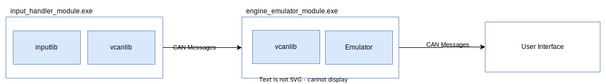
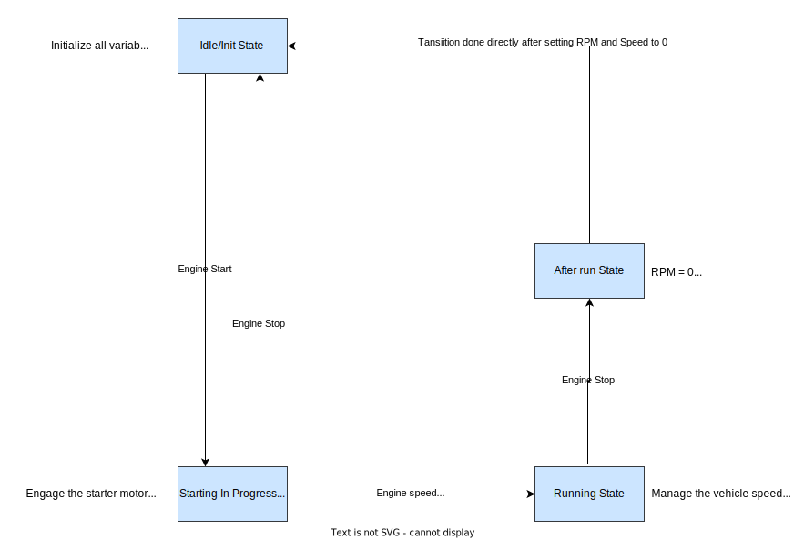
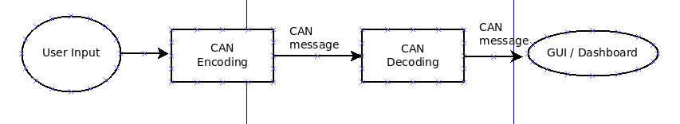
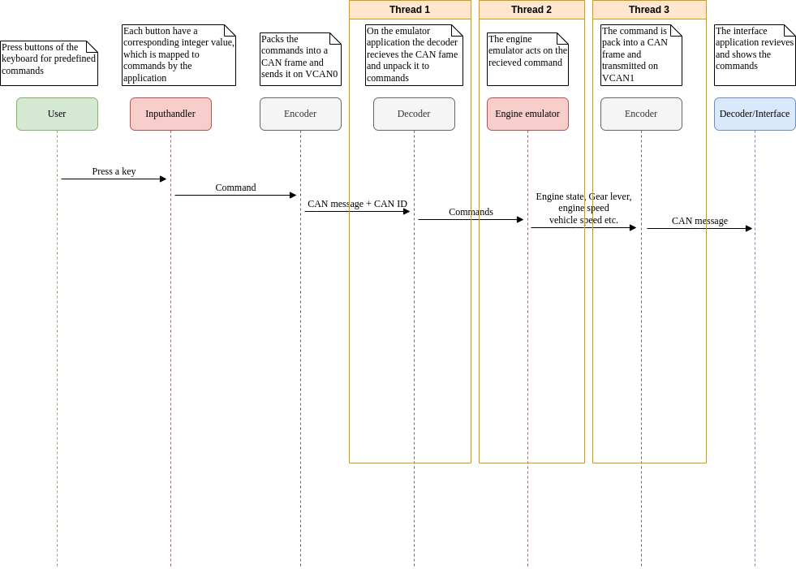

# Ramone Engine Gearbox Simulator Software Design

**Version :** 2.0.0

## Information

**Responsible Team:** Ramone

**People:**

|Name|Role|
|-|-|
|Per Ternström|Developer|
|Noureldin Fouad|Developer|
|Stina Karnlind|Developer|
|Taycir Louati|Developer|

**Team Scrum Board**

Ramon team scrum board link: https://nfouad1.atlassian.net/jira/software/projects/TRCP/boards/1

## Abbreviations

|Short|Long|
|-|-|
|**EGS**|Engine Gearbox Simulator|
|**CAN**|Controller Area Network| 
|**CRC**|Cyclic Redundancy Check|  
|**GUI**|Graphical user interface|

## Introduction

The purpose of this project is for the team to build an Engine Gearbox simulator and apply/develop the team's C++ skills. The intention is to create a robust system with well written code and good optimization efforts. 

## Module Overview

The following overview shows the system description of EGS. 

For this demo, the executable input_handler_module.exe has been implemented according to the available specification. 

## Engine Emulator State Machine

The following figure shows the state machine of the engine simulation.

## Use Cases

* **Use Case 1:** 
1. User starts the Engine. 
2. Engine Emulator checks if the gear level is in P (Park). 
3. The user can see the user interface lightning up.
4. The engine is shutdown by the user.

* **Use Case 2:** 
1. User start the Engine. 
2. Engine Emulator checks if the gear level is in P (Park)
3. The user can see the user interface lightning up. 
4. User pushes the gear level button to R (Reverse). 
5. User pushes the acceleration pedal down 10% and lets the RPM run until it reaches tbd  
6. User releases the acceleration pedal.
7. User presses break and put the gear to P.
8. The engine is shutdown by the user.

* **Use Case 3:** 
1. User start the Engine. 
2. Engine Emulator check if the gear level is in P (Park) 
3. The user can see the user interface lightning up.
4. User pushes the gear level button to D (Drive). 
5. GUI indicates gear "D".
6. User pushes the acceleration pedal down 50% and lets the RPM run until it reaches tbd 
7. User releases the acceleration pedal and presses break and put the gear to P. 
8. The engine is shutdown by the user.

* **Use Case 4:** 
1. User start the Engine. 
2. Engine Emulator check if the gear level is in P (Park)
3. The user can see the user interface lightning up.
4. User pushes the gear level button to N (Normal). 
5. User... TBD

For this version of design document, the logic and the interfaces for realizing the complete project are not considered yet.

## Flow Diagram

The following figure shows an overview of the flow diagram of EGS1.0.

## Sequence Diagram

The following figure shows an overview of the sequence diagram of EGS1.0.

## CAN classic vs CAN FD

|Attribute|CAN Classic|CAN FD|Comment|
|-|-|-|-|
|Frame size |8 byte|Up to 64 byte|-|
|Data rate|1 Mbit/s |8 Mbit/s|Dependent on topology and hardware|
|Data rate|fixed |dynamically mod|-|
|Error handling|CRC weakness|Improved CRC|Cyclic redundancy check|
|Arbitration bit rate|1 Mbit/s |1 Mbit/s|-|

In this project it is decided to send data over CAN classic. This protocoll will support the need for this project.

## Test

Google test is an open source unit test library that will be used for this EGS project.

Cpplint is an open source static code analysis tool, it implements what Google considers best practices in C++ coding and conforms to Google's coding style guides. It also identifies syntax errors. Cpplint has been applied int the EGS project. When checking the EGS program code the following is needed:

For installation:
$ pip install cpplint

For running:
~$ cpplint --linelength=120 <file path>

$ cpplint --linelength=120 [OPTIONS] files
## Local Installation

In order to run and compile this program a compiler and an IDE needs to be installed on your computer during the development process g++ GNU compiler and Visual Studio Code as IDE. The oprating system has been Ubuntu 18.4 (or later version).

The EGS application can be downloaded from GitHub from [here](git@github.com:TaycirLouati/Ramon_Engine_Gearbox_simulator.git).

CMake 3.10 (or a later version) is also required to be installed in order to build the files as a complete program. 

